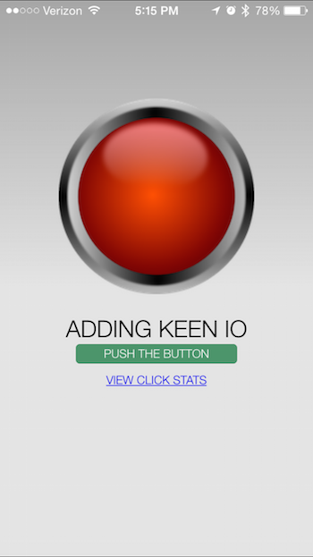
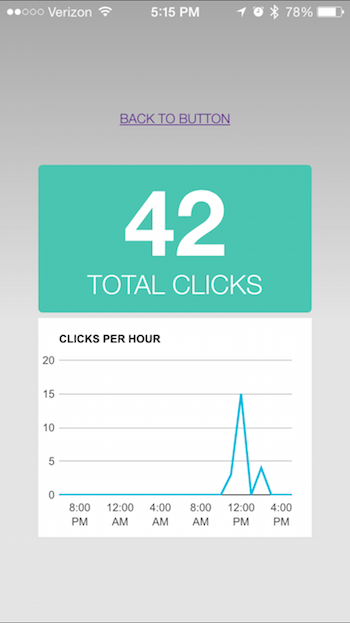

# Phonegap-keen

Example of integrating Keen IO into a Phonegap application.

This code serves as an example of how to add Keen IO analytics to your application. Any suggestions or code clean ups appreciated!
